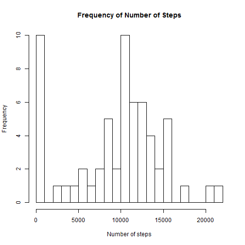
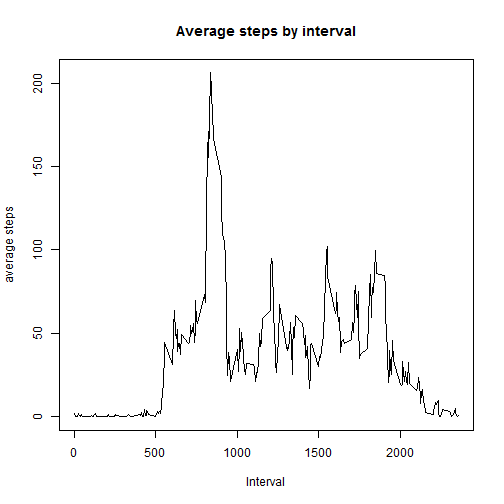
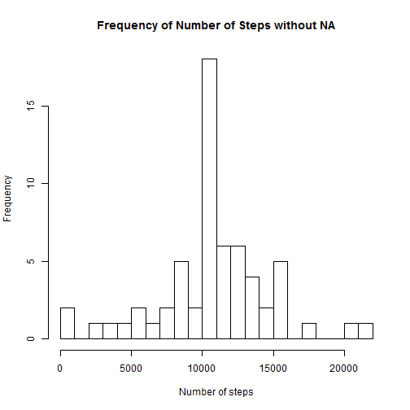

We first download the data file, and then load it into R. The Date column in converted into a Date type.


```r
data <- read.csv("repdata-data-activity\\activity.csv")
data$date <- as.Date(data$date, "%Y-%m-%d")
```

To calculate the number of steps per day, I used the plyr package.

```r
library(plyr)
databyday<-ddply(data, .(date), 
      summarize, 
      stepsbyday = sum(steps, na.rm=TRUE))
```
a histogram of the total number of steps taken each day

```r
hist(databyday$steps, breaks=20,main="Frequency of Number of Steps", xlab="Number of steps")
```

 
the mean and median of the total number of steps taken per day

```r
meanbyday<-mean(databyday$steps)
medianbyday<-median(databyday$steps)
meanbyday
```

```
## [1] 9354.23
```

```r
medianbyday
```

```
## [1] 10395
```

Next, we make a time series plot, to show the average number of steps take across all days

 
The 5 min interval, which contains the average maxiumum number of steps is

```r
databyinterval[which.max(databyinterval$stepsbyinterval),2]
```

```
## [1] 206.1698
```

To view the total number of missing values, we can view the summary of the initial dataset

```r
summary(data)
```

```
##      steps             date               interval     
##  Min.   :  0.00   Min.   :2012-10-01   Min.   :   0.0  
##  1st Qu.:  0.00   1st Qu.:2012-10-16   1st Qu.: 588.8  
##  Median :  0.00   Median :2012-10-31   Median :1177.5  
##  Mean   : 37.38   Mean   :2012-10-31   Mean   :1177.5  
##  3rd Qu.: 12.00   3rd Qu.:2012-11-15   3rd Qu.:1766.2  
##  Max.   :806.00   Max.   :2012-11-30   Max.   :2355.0  
##  NA's   :2304
```

There are 2304 NA values for steps.

To replace the missing values, I am substituting the values with the average value for that interval

```r
mergedData <- merge(data, databyinterval, by="interval")


for(i in 1:nrow(mergedData)) {
  if(is.na(mergedData[i,"steps"]))
    mergedData[i,"steps"]<-mergedData[i,"stepsbyinterval"]
    
}

completeData<-ddply(mergedData, .(date), 
      summarize, 
      SumOfStepsbyDay = sum(steps))
hist(completeData$SumOfStepsbyDay, breaks=20,main="Frequency of Number of Steps without NA", xlab="Number of steps")
```

 

```r
mean(completeData$SumOfStepsbyDay)
```

```
## [1] 10766.19
```

```r
median(completeData$SumOfStepsbyDay)
```

```
## [1] 10766.19
```

The difference in the 2 histograms is that in the first one, we had a high number of 0s. However,  once those were replaced by the mean values of the respective intervals, we now see a jump in the frequency of the the steps that are close the mean values or the center of the histogram.

Creating a new factor variable:weekday

```r
mergedData$day<- "weekday"
for(i in 1:nrow(mergedData)) {
  if(weekdays(mergedData[i,"date"]) =="Saturday" || weekdays(mergedData[i,"date"]) =="Sunday")
              mergedData[i,"day"]<-"weekend"
      
}
mergedData$day<-as.factor(mergedData$day)
```

Generating the panel plot

```r
library(ggplot2)
avgsteps<-ddply(mergedData,.(interval,day), summarize, avg_steps=mean(steps))
sp<-ggplot(data=avgsteps, aes(x=interval, y=avg_steps, group=1)) +
    geom_line()
sp + facet_grid(day ~ .)
```

 

